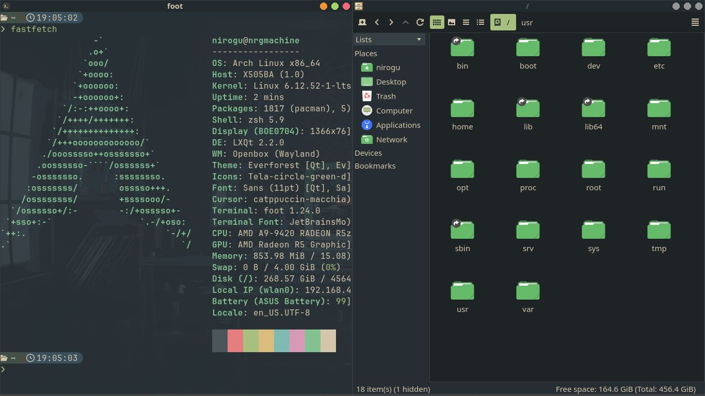
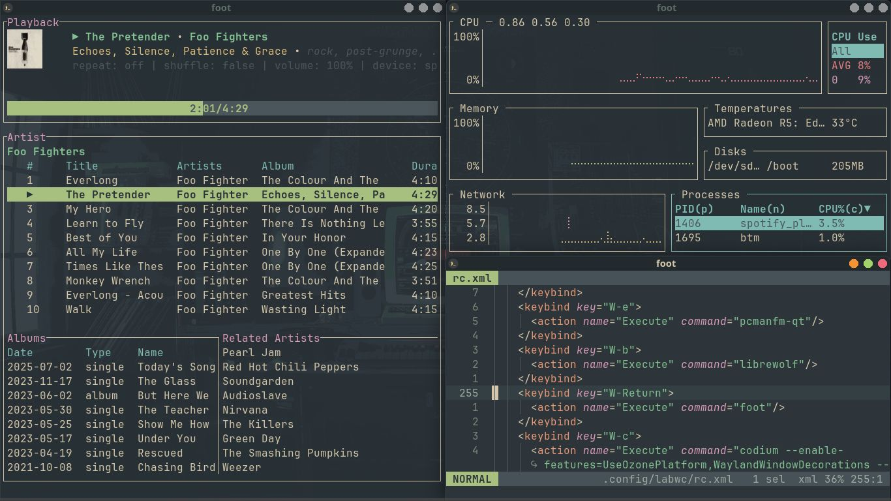
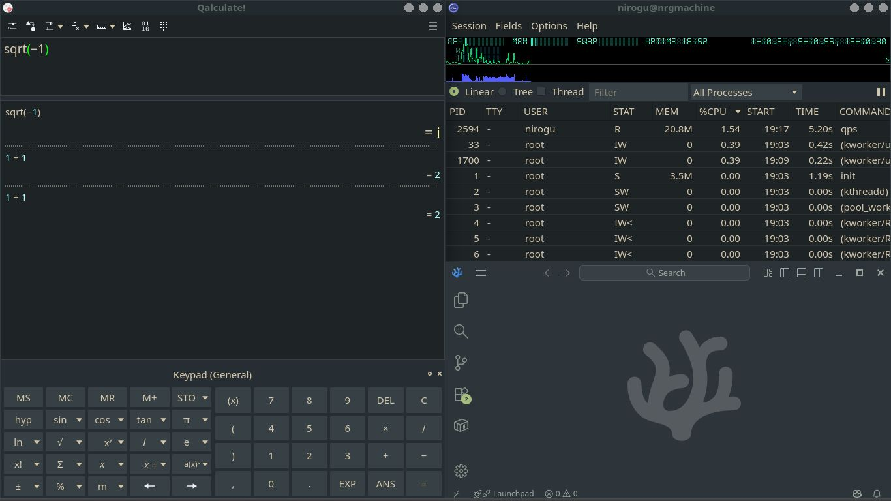

# Nirogu-dotfiles

My personal dotfiles for arch-linux + lxqt + labwc + everforest theme.

## Installation

Everything goes in `$HOME/.config`, excepting:
- `zshrc` goes in `$HOME/.zshrc`
- `gitconfig` goes in `$HOME/.gitconfig`
- `themes` goes in `$HOME/.themes`
- `sddm/sddm.conf` goes in `/etc/sddm.conf`
- `sddm/everforest` goes in `/usr/share/sddm/themes/everforest`
- `sddm/config` goes in `/var/lib/sddm/.config`

## Software

- **Operating system:** [Arch linux](https://archlinux.org)
- **Desktop environment:** [LXQt](https://lxqt-project.org) with [Kvantum](https://github.com/tsujan/Kvantum/) theming
- **Wayland compositor:** [Labwc](https://labwc.github.io)
- **X11 window manager:** [Openbox](https://openbox.org)
- **Color scheme:** [Everforest](https://github.com/sainnhe/everforest)
- **Display manager:** [SDDM](https://github.com/sddm/sddm)
- **Terminal:** [Foot](https://codeberg.org/dnkl/foot) (wayland only)
- **Shell:** [Zsh](https://www.zsh.org) with the [starship](https://starship.rs) prompt
- **Text editor:** [Helix](https://helix-editor.com), [AstroNvim](https://astronvim.com) and [VSCodium](https://vscodium.com)
- **Screen locker:** [Swaylock](https://github.com/swaywm/swaylock)
- **Document reader:** [Zathura](https://pwmt.org/projects/zathura)

Additional software

- **Web browser:** [LibreWolf](https://librewolf.net) and [Helium](https://helium.computer)
- **Email client:** [Thunderbird](https://www.thunderbird.net) and [aerc](https://aerc-mail.org)
- **Music player:** [Spotify-player](https://github.com/aome510/spotify-player) and [strawbery](https://www.strawberrymusicplayer.org)
- **Video player:** [MPC-QT](https://mpc-qt.github.io)
- **System monitor:** [btop](https://github.com/aristocratos/btop) and [bottom](https://github.com/ClementTsang/bottom)
- **Qt desktop utilities:** [Eqonomize](https://eqonomize.github.io), [Qalculate](https://qalculate.github.io), [FeatherPad](https://github.com/tsujan/FeatherPad), [QDirStat](https://github.com/shundhammer/qdirstat) and [qpdfview](https://launchpad.net/qpdfview)
- **VPN:** [IVPN](https://www.ivpn.net/en)
- **Torrent client:** [qBittorrent](https://www.qbittorrent.org)
- **Password manager:** [KeePassXC](https://keepassxc.org)
- **Git TUI:** [Lazygit](https://github.com/jesseduffield/lazygit)
- **Docker TUI:** [Lazydocker](https://github.com/jesseduffield/lazydocker)
- **Office suite:** [LibreOffice](https://www.libreoffice.org)
- **GTK settings:** [nwg-look](https://github.com/nwg-piotr/nwg-look)
- **Emacs configuration:** [Spacemacs](https://www.spacemacs.org)

## Keybindings

| Keys                                    | Action             |
| --------------------------------------- | ------------------ |
| <kbd>SUPER</kbd> + <kbd>SPACE</kbd>     | Runner             |
| <kbd>SUPER</kbd> + <kbd>ENTER</kbd>     | Spawn terminal     |
| <kbd>SUPER</kbd> + <kbd>B</kbd>         | Spawn browser      |
| <kbd>SUPER</kbd> + <kbd>E</kbd>         | Spawn file manager |
| <kbd>SUPER</kbd> + <kbd>C</kbd>         | Spawn code editor  |
| <kbd>SUPER</kbd> + <kbd>A</kbd>         | Toggle maximize    |
| <kbd>SUPER</kbd> + <kbd>Q</kbd>         | Kill window        |
| <kbd>SUPER</kbd> + <kbd>BACKSPACE</kbd> | Logout menu        |

More keybindings can be found in the [labwc configuration file](labwc/rc.xml).

## License

These dotfiles are released under the 0BSD license, which is functionally equivalent to a release into the public domain (anyone can use these dotfiles without any restrictions or warranties).
